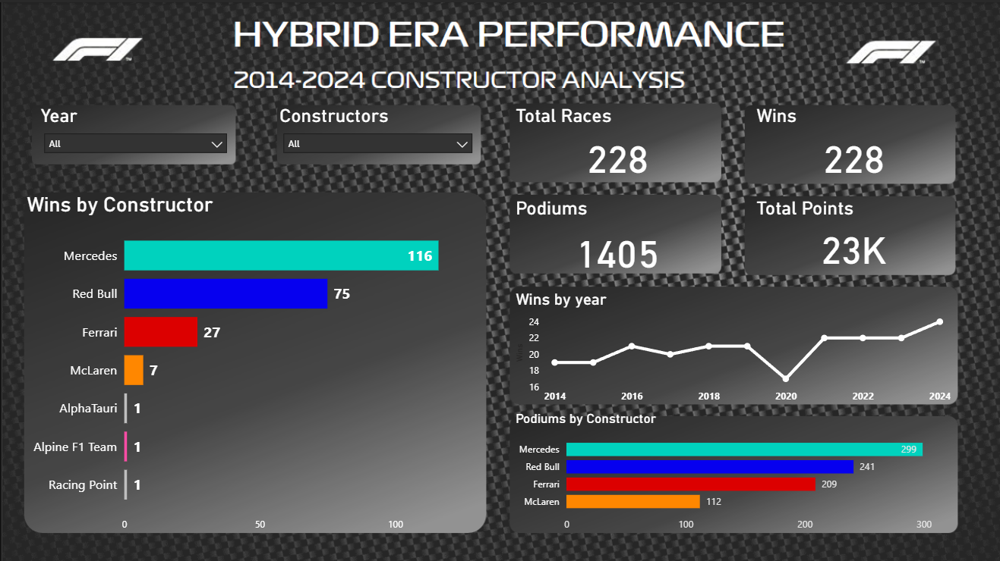
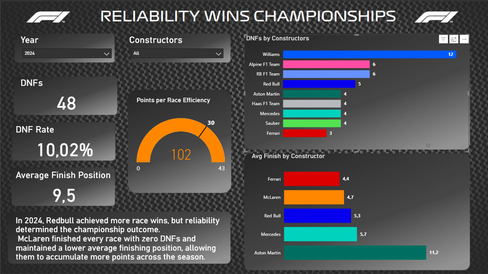

# f1-hybrid-era-powerbi-dashboard
Power BI dashboard analyzing Formula 1 constructor performance during the Hybrid Era (2014–2024)

### 🚀 Key Features

- Interactive Power BI dashboard
- Analysis of Formula 1 constructors (2014–2024)
- Reliability and performance metrics
- Dynamic constructor color system

### Performance Overview

### Reliability Analysis

